## EE559 Final-Project APS Failure at Scania Trucks Dataset

### Project Information:

​	The dataset consists of data collected from heavy Scania trucks in everyday usage.The system in focus on the “Air Pressure system (APS) which generates pressurized air that are utilized in various functions in a truck, such as braking and gear changes.” [1]. This is a 2-class problem, and the goal is to predict the failure of components in the APS system, given various inputs. 


### Data:

Training and testing are posted on [D2L](https://courses.uscden.net/d2l/le/content/15346/Home?itemIdentifier=D2L.LE.Content.ContentObject.ModuleCO-251275); the training set labeled “SMALLER” has been down-sampled by factor of 3 (stratified), from the complete training set. The complete training set is also posted on D2L in case you choose to work with it also.* Please use the complete test set, as posted on D2L, for your test set. (There is no down-sampled version of the test set.)
For more information on the dataset:
https://archive.ics.uci.edu/ml/datasets/APS+Failure+at+Scania+Trucks


### Data Preprocessing

#### Data missing:

1. When a feature have a lot of missing data, we can directly drop this feature.

   Code:

   we can see how much data is missing within a feature at first:

   `print(data.isna().sum(axis = 0))`

   then drop features that missing 70% data

   `print(data.dropna(thresh=19999*0.7,axis = 1))`

2. When the missing rate is under 10%, we can use methods below:

   1. We can drop sample that misses some feature.(this method may not try)

      Code:

      `data.dropna()`

      when one sample miss half of its feature data

   2. Treat missing as a class of feature.

      Code:

      `data.fillna('missing')`

   3. Using the mean/mode/median of existed datas to fill these missing datas.

      Code:

      `data.fillna(data.mean())`, `dff.fillna(dff.mean()['B':'C'])`(focus on some columns)

   4. Using KNN or fill with next(bfill) or last(pad) data.

      Code:

      `data.fillna(#)`

      has `method='pad'` , `method='bfill' `

   5. Using interpolate method.

      Code:

      `data.interpolate()`

      how to use interpolate please check at [pandas document](<http://pandas.pydata.org/pandas-docs/stable/user_guide/missing_data.html>).

3. Train a model to predict this miss data.

   We can use R programming to solve this problem with mice package.（difficult, i will try this method after I finished the baseline)
   
4. Finally, I will try the finally method as :

**method1**

   a.	when missing data rate > 70%, Drop this feature.

   ~~b.	when missing data rate < 5%,  i will use mean to fill them.~~

   ~~c.	others rate , I will use interpolate to fill them. What's more, if that feature have less than 20 classes, we can sat nah as a new class. And use onehotencoding to encode these features.~~

   d.	I will a new feature that will show how many data miss within this sample after I finish drop and fill by ~~mean~~ median.

   ```data['missing number'] = data.isna().sum(axis = 1)```

   ~~e.	For rest missing data, I will interpolate method to fill them.~~
#### Scaler and Dimension Reduction:

I use StandardScaler and PCA at first, on next time i will try other methods!

What we should pay more attention is that : we can use testdata to train their own scaler and PCA.

```from sklearn.preprocessing import StandardScaler
from sklearn.decomposition import PCA
scaler = StandardScaler()
scaler.fit(train_data)
train_data_scaler = scaler.transform(train_data)
test_data_scaler = scaler.transform(test_data)
pca = PCA(0.95)
pca.fit(train_data_scaler)
train_data_pca = pca.transform(train_data_scaler)
train_data_preprocessed = pd.DataFrame(train_data_pca)
test_data_pca = pca.transform(test_data_scaler)
test_data_preprocessed = pd.DataFrame(test_data_pca)
```


#### Data imbalance

Using imbalanced-learn package of python (I should finished it by my self).

Our training data has serious data imbalance, more than 90% sample are negative.

there are several method can use to solve this problem:

1. duplicate oversample and downsample
2. SMOTE
3. ROC-AUC/F1 score

The first method can't be used alone , because the data is so much imbalance, so we should combine this 3 method.

###Classifier

#### Validation

cross-validation with code:

```python
from sklearn.model_selection import StratifiedKFold
cv = StratifiedKFold(n_splits=5)
for train, val in cv.split(train_data_balance, train_label_balance):
  ...
  
```


#### Classifier Model:

We have so many choices:

1. SGD Classifier(perceptron)

2. Gaussian Naive Bayes

3. Logistic Regression

4. SVM

5. Random Forest

6. XGBroost

7. KNN

    

#### Evaluation:

I will use Roc Auc score :

```python
from sklearn.metrics import roc_auc_score
...
roc_auc_score(train_label_balance[val],y_pred)
```

Finally, I will use confusion_matrix and f1-score to evaluate this classier:

```python
from sklearn.metrics import f1_score,confusion_matrix
cm = confusion_matrix(test_label,y_pred_test).ravel()
cm = pd.DataFrame(cm.reshape((1,4)), columns=['TN', 'FP', 'FN', 'TP'])
print(cm.info())
```


### Problem in this Project

1. pandas can't recognize the missing data "na", the regular missing data will present as "NaN" or "None" etc.

   I used 

   `data = pd.read_csv("../finaldata/aps_failure_training_set_SMALLER.csv"')`

   at first, but these code will not treat na in csv file as NaN(NULL)

   Solution:

   `data = pd.read_csv("../finaldata/aps_failure_training_set_SMALLER.csv" , na_values='na')`
   
2. To check which feature has less than 20 classes, i use R studio to explore by code:

   ```
   data<-read.csv('aps_failure_training_set_SMALLER.csv',na.strings = 'na')
   for (i in 2:ncol(data)) {
     if(length(table(data[i])) < 20 )
     {
       print(table(data[i]))
       print(names(data[i]))
     }
   }
   ```

   we can use one hot encoder on these features.

   These features and their classes are :

   ```
   [1] "ab_000"
      0    2    4    6    8   10   12   14   16   18   20   22   26   34   52   68 
   3626  654  128   42   22   14   10    3    1    2    1    2    1    2    1    1 
   
   [1] "as_000"
         0       4    6268   21748  128844  489122  693990 1246190 1655240 
     19760       1       1       1       1       1       1       1       1 
   
   [1] "cd_000"
   1209600 
     19753 
   
   [1] "ch_000"
       0     2 
   15019     5 
   
   [1] "ef_000"
       0     2     4     6     8    10    12    14    26    74   144   166   276   320 
   18972    47    21     7     2     2     2     2     1     1     2     1     1     1 
   ```


3. Using StandardScaler and PCA to preprocess training data, what's more, we should use same processor on test data.


### Record Log:

1. Parameter:

   Method: Logistic Regression (Final Recall score for c param **100** and penalty **l2** = **0.936032**)

   Imbalance solution: Smote

   Preprocessing: method 1

   Result : 

   ```python
           TN     FP    FN     TP
   0  15243.0  382.0  38.0  337.0
   The final cost is : 0    22820.0
   ```


2. Parameter

   Method: SVM (Final Recall score for c param **0.01**, gamma  **0.01** and kernel linear = **0.948**)

   Imbalance solution: Smote

   Preprocessing: method 1

   Result:

   ```python
           TN     FP    FN     TP
   0  15250.0  375.0  30.0  345.0
   The final cost is : 0    18750.0
   ```

   

3. Parameter

   Method: SVM (Final Recall score for c param **0.1**, gamma  **0.01** and kernel linear = **0.9336213333333334**)

   Imbalance solution: Smote

   Preprocessing: method 1

   Result:

   ```python
         TN   FP  FN   TP
   0  15259  366  41  334
   The final cost is : 0    24160
   ```

   

4. Parameter

   Method: SVM (Final Recall score for c param **0.1**, gamma  **0.01** and kernel rbf = 0.**9596586666666667**)

   Imbalance solution: Smote

   Preprocessing: method 1

   Result:

   ```python
         TN   FP  FN   TP
   0  15031  594  16  359
   The final cost is : 0    13940
   ```

   

   

5. Parameter

   Method: SVM (Final Recall score for c param **0.01**, gamma  **0.01** and kernel rbf = **0.9564266666666666**)

   Imbalance solution: Smote

   Preprocessing: method 1

   Result:

   ```python
         TN   FP  FN   TP
   0  14680  945  10  365
   The final cost is : 0    14450
   ```

   

6. Parameter

   Method: SVM (Final Recall score for c param **1**, gamma  **0.01** and kernel rbf = **0.9576746666666667**)

   Imbalance solution: Smote

   Preprocessing: method 1

   Result:

   ```python
         TN   FP  FN   TP
   0  14719  906  10  365
   The final cost is : 0    14060
   ```

   

7. Parameter

   Method: SVM (Final Recall score for c param **0.01**, gamma  **0.1** and kernel sigmoid = **0.854976**)

   Imbalance solution: Smote

   Preprocessing: method 1

   Result:

   ```python
         TN    FP  FN   TP
   0  12593  3032  36  339
   The final cost is : 0    48320
   ```

   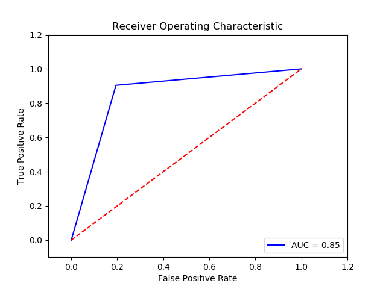

8. Parameter

   Method: SVM (Final Recall score for c param **0.01**, gamma  **0.1** and kernel poly = **0.8346986666666666**)

   Imbalance solution: Smote

   Preprocessing: method 1

   Result:

   ```python
         TN   FP   FN   TP
   0  15501  124  121  254
   The final cost is : 0    61740
   ```

   

9. Parameter

   Method: SGD Perceptron (Final Recall score for penalty **L2** =**0.9299541333333332**)(10 times and get the average)

   Imbalance solution: Smote

   Preprocessing: method 1

   Result:

   ```python
           TN     FP    FN     TP
   0  14844.4  780.6  33.8  341.2
   The final cost is : 0    24706.0
   ```

   

10. Parameter

  Method: SGD Perceptron (Final Recall score for penalty **L1* =0.9261888**)(10 times and get the average)

  Imbalance solution: Smote

  Preprocessing: method 1

  Result:

  ```python
          TN     FP    FN     TP
  0  14993.4  631.6  40.2  334.8
  The final cost is : 0    26416.0
  ```

  

11. Parameter

    Method: Gaussian Naive Bates (Final Recall score ** =0.9076488**)(10 times and get the average)

    Imbalance solution: Smote

    Preprocessing: method 1

    Result:

    ```python
            TN     FP    FN     TP
    0  15114.0  511.0  57.0  318.0
    The final cost is : 0    33610.0
    ```

    

12. Parameter

    Method: SVM (Recall score for c param **10** and kerne **rbf** and gamma **0.01**   = **0.9891437681831583**)(10 times and get the average)

    Imbalance solution: Smote

    Preprocessing: method 2

    Result:

    ```python
            TN     FP    FN     TP
    0  14763.0  862.0  13.0  362.0
    The final cost is : 0    15120.0
    ```

    

13. Parameter

    Method: SVM (Final Recall score for c param **0.1**, gamma  **0.01** and kernel rbf = 0.**9596586666666667**)

    Imbalance solution: Smote

    Preprocessing: method 2

    Result:

    ```python
            TN     FP    FN     TP
    0  15023.0  602.0  14.0  361.0
    The final cost is : 0    13020.0
    ```

    

    

14. Parameter

    Method: SVM (Final Recall score for c param **0.01**, gamma  **0.01** and kernel rbf = **0.9559786666666668**)

    Imbalance solution: Smote

    Preprocessing: method 2

    Result:

    ```python
            TN     FP    FN     TP
    0  14666.0  959.0  10.0  365.0
    The final cost is : 0    14590.0
    ```

    

    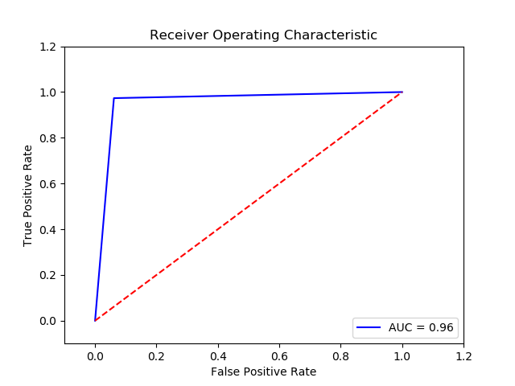

15. Parameter:

    Method: Logistic Regression (Final Recall score for c param **100** and penalty **l2** = **0.9273386666666668**)

    Imbalance solution: Smote

    Preprocessing: method 2

    Result : 

    ```python
            TN     FP    FN     TP
    0  15271.0  354.0  46.0  329.0
    The final cost is : 0    26540.0
    ```

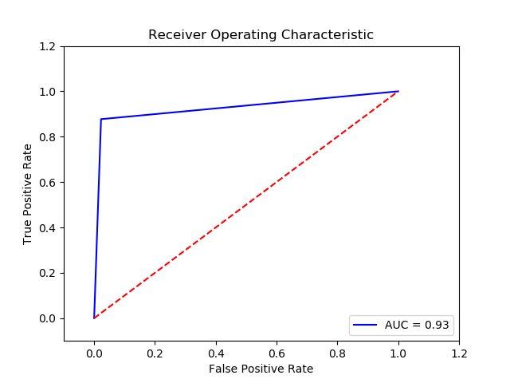

16. Parameter

    Method: Gaussian Naive Bates (Final Recall score **=0.9063146666666666**)(10 times and get the average)

    Imbalance solution: Smote

    Preprocessing: method 2

    Result:

    ```python
            TN     FP    FN     TP
    0  15114.0  511.0  58.0  317.0
    The final cost is : 0    34110.0
    ```

    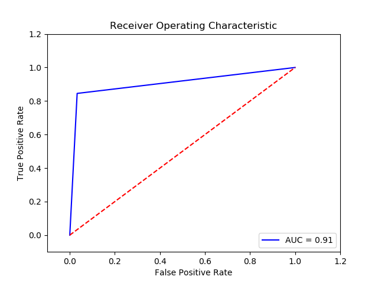

17. Parameter

    Method: SGD l2 Perceptron (Final Recall score for penalty **L2** =**0.9397418666666667**)(10 times and get the average)

    Imbalance solution: Smote

    Preprocessing: method 2

    Result:

    ```python
            TN     FP    FN     TP
    0  14733.6  891.4  23.8  351.2
    The final cost is : 0    20814.0
    ```

    

18. Parameter

    Method: SGD Perceptron (Final Recall score for penalty **L1** =**0.9397418666666667**)(10 times and get the average)

    Imbalance solution: Smote

    Preprocessing: method 2

    Result:

    ```python
            TN     FP    FN     TP
    0  14908.2  716.8  45.2  329.8
    The final cost is : 0    29768.0
    ```

    

19. Parameter

    Method: SVM 0.1 0.01 RBF (Final Recall score=**0.949984**)(10 times and get the average)

    Imbalance solution: Smote

    Preprocessing: method 2

    Scaler: MinMax Scaler

    Result:

    ```
            TN     FP    FN     TP
    0  14937.0  688.0  21.0  354.0
    The final cost is : 0    17380.0
    ```

    

20. Parameter

    Method: SVM 0.1 0.01 RBF (Final Recall score  =**0.9379413333333331**)(10 times and get the average)

    Imbalance solution: Smote

    Preprocessing: method 1

    Scaler: MinMax Scaler

    Result:

    ```
            TN     FP    FN     TP
    0  15019.0  606.0  32.0  343.0
    The final cost is : 0    22060.0
    ```

    

21. Parameter:

    Method: Logistic Regression (Final Recall score for c param **100** and penalty **l2** = **0.9437119999999999**)

    Imbalance solution: Smote

    Preprocessing: method 1

    Scaler: MinMax

    Result : 

    ```python
        TN     FP    FN     TP
    0  15116.0  509.0  30.0  345.0
    The final cost is : 0    20090.0
    ```

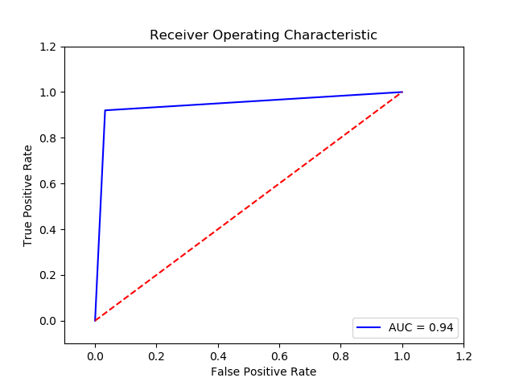

22. Parameter:

    Method: Logistic Regression (Final Recall score for c param **100** and penalty **l2** = **0.9445866666666667**)

    Imbalance solution: Smote

    Preprocessing: method 2

    Scaler: MinMax

    Result : 

    ```python
            TN     FP    FN     TP
    0  14935.0  690.0  25.0  350.0
    The final cost is : 0    19400.0
    ```

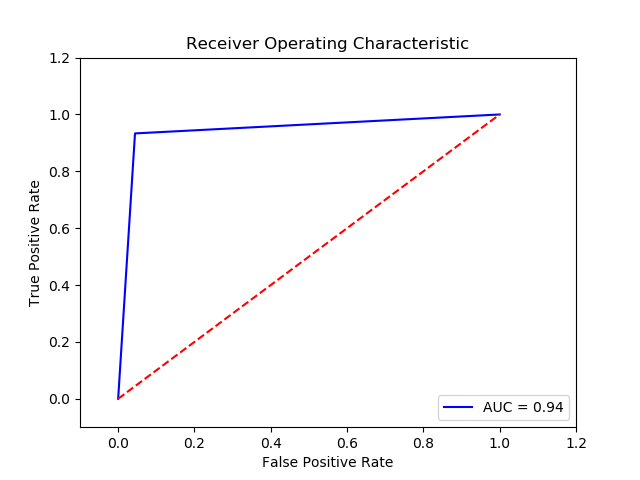

23. Parameter

    Method: Gaussian Naive Bates (Final Recall score **=0.9260053333333331**)(10 times and get the average)

    Imbalance solution: Smote

    Preprocessing: method 2

    Scaler: MinMax Scaler

    Result:

    ```
           TN     FP    FN     TP
    0  14896.0  729.0  38.0  337.0
    The final cost is : 0    26290.0
    ```

    

24. Parameter

    Method: Gaussian Naive Bates (Final Recall score **=0.9261013333333334**)(10 times and get the average)

    Imbalance solution: Smote

    Preprocessing: method 1

    Scaler: MinMax Scaler

    Result:

    ```
            TN     FP    FN     TP
    0  14899.0  726.0  38.0  337.0
    The final cost is : 0    26260.0
    ```

    

25. Parameter

    Method: Svm 0.01 0.1 rbf  (Final Recall score =**0.9405119999999998**)(10 times and get the average)

    Reduce: SelectKBest (84)

    Imbalance solution: Smote

    Preprocessing: method 1

    Result:

    ```python
            TN     FP    FN     TP
    0  15016.0  609.0  30.0  345.0
    The final cost is : 0    21090.0
    ```

    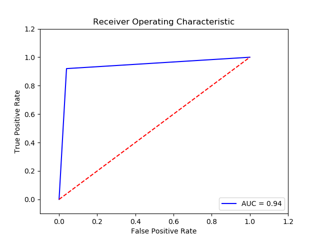

26. Parameter

    Method: Svm 0.01 0.1 rbf  (Final Recall score =**0.9403520000000001**)(10 times and get the average)

    Reduce: SelectKBest (84)

    Imbalance solution: Smote

    Preprocessing: method 2

    Result:

    ```python
            TN     FP    FN     TP
    0  15011.0  614.0  30.0  345.0
    The final cost is : 0    21140.0
    ```

    

27. Parameter

    Method:SGD Perceptron  (Final Recall score l2  =**0.9390314666666668**)(10 times and get the average)

    Reduce: SelectKBest (84)

    Imbalance solution: Smote

    Preprocessing: method 1

    Result:

    ```python
            TN     FP    FN     TP
    0  14786.4  838.6  25.6  349.4
    The final cost is : 0    21186.0
    ```

    

28. Parameter

    Method: Gaussian Naive Bates (Final Recall score **=0.940512**)(10 times and get the average)

    Imbalance solution: Smote

    Preprocessing: method 1/method 2

    Scaler: MinMax Scaler

    Reduce: KBest 

    Result:

    ```
            TN     FP    FN     TP
    0  15141.0  484.0  33.0  342.0
    The final cost is : 0    21340.0
    ```

    

29. Parameter:

    Method: Logistic Regression (Final Recall score for c param **100** and penalty **l2** = **0.9349333333333334**)

    Imbalance solution: Smote

    Preprocessing: method 1

    Result : 

    ```python
            TN     FP    FN     TP
    0  15300.0  325.0  41.0  334.0
    The final cost is : 0    23750.0
    ```


30. Parameter:

    Method: Logistic Regression (Final Recall score for c param **100** and penalty **l2** = **0.9348053333333335**)

    Imbalance solution: Smote

    Preprocessing: method 2

    Result : 

    ```python
            TN     FP    FN     TP
    0  15296.0  329.0  41.0  334.0
    The final cost is : 0    23790.0
    ```


31. Parameter:

    Method: KNN5 (Final Recall score= **0.9298133333333334**)

    Imbalance solution: Smote

    Preprocessing: method 1

    Result : 

    ```python
            TN     FP    FN     TP
    0  15265.0  360.0  44.0  331.0
    The final cost is : 0    25600.0
    ```

    

32. Parameter:

    Missing Data method: .method2

    Scaler: .minmax

    Feature Selection: .KBest

    Imbalance Solution: .SMOTE

    Parameter:  ['KNN', 5]

    Final Recall score for Classifier (.['KNN', 5])= .0.9325119999999998

    Result : 
    ```python
            TN     FP    FN     TP
    0  15266.0  359.0  42.0  333.0
    The final cost is : 0    24590.0
    ```
    

33. Parameter:

    Missing Data method: .method1

    Scaler: .standard

    Feature Selection: .pca

    Imbalance Solution: .SMOTE

    Parameter:  ['KNN', 5]

    Final Recall score for Classifier (.['KNN', 5])= .0.9321173333333335

    \-------------------------

    ```python
            TN     FP    FN     TP
    
    0  15337.0  288.0  44.0  331.0
    
    The final cost is : 0    24880.0
    
    
    ```

    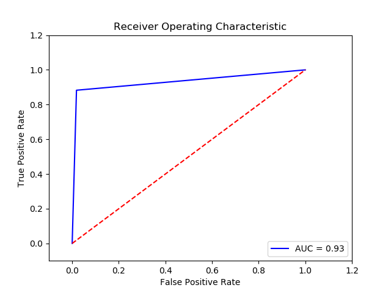

    

34. Parameter:

    Missing Data method: .method1

    Scaler: .standard

    Feature Selection: .pca

    Imbalance Solution: .SMOTE

    Parameter:  ['NN']

    Final Recall score for Classifier (.['NN'])= .0.8383402666666667

    ```python
            TN    FP     FN     TP
    0  15539.8  85.2  119.2  255.8
    The final cost is : 0    60452.0
    ```

    

35. Parameter:

    Missing Data method: .method1

    Scaler: .minmax

    Feature Selection: .pca

    Imbalance Solution: .SMOTE

    Parameter:  ['NN']

    Final Recall score for Classifier (.['NN'])= 0.8375061333333333

    ```python
             TN    FP     FN     TP
    0  15555.4  69.6  120.2  254.8
    The final cost is : 0    60796.0
    ```

    

36. Parameter:

    Missing Data method: .method2

    Scaler: .minmax

    Feature Selection: .pca

    Imbalance Solution: .SMOTE

    Parameter:  ['NN']

    Final Recall score for Classifier (.['NN'])= 0.8375061333333333

    ```python
            TN    FP     FN     TP
    0  15541.0  84.0  109.4  265.6
    The final cost is : 0    55540.0
    ```

    

37. Parameter:

    Missing Data method: .method1

    Scaler: .minmax

    Feature Selection: .K Best 

    Imbalance Solution: .SMOTE

    Parameter:  ['NN']

    Final Recall score for Classifier (.['NN'])=0.8576085333333333

    ```
            TN     FP     FN     TP
    0  15508.6  116.4  104.0  271.0
    The final cost is : 0    53164.0
    ```

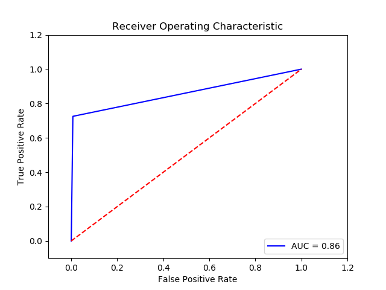

38. 

    Missing Data method: .method2

    Scaler: .standard

    Feature Selection: .pca

    Imbalance Solution: .SMOTE

    Parameter:  ['NN']

    Final Recall score for Classifier (.['NN'])= .0.8497791999999998

    ```
            TN    FP     FN     TP
    0  15530.6  94.4  110.4  264.6
    The final cost is : 0    56144.0
    ```

    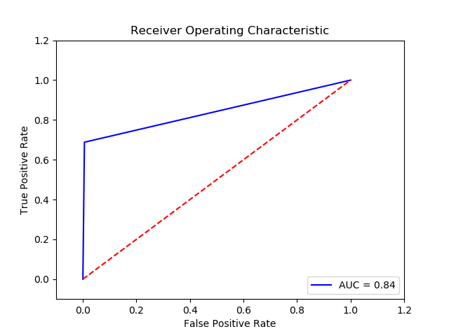

39. Parameter:

    Missing Data method: .method2

    Scaler: .minmax

    Feature Selection: .K Best 

    Imbalance Solution: .SMOTE

    Parameter:  ['NN']

    Final Recall score for Classifier (.['NN'])=0.8497173333333332

    ```
            TN     FP     FN     TP
    0  15512.0  113.0  110.0  265.0
    The final cost is : 0    56130.0
    ```

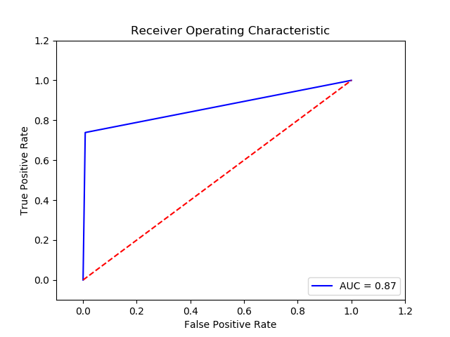

40. Parameter:
    Missing Data method: .method1

    Scaler: .standard
    Feature Selection: .pca
    Imbalance Solution: .SMOTE

    Final Recall score for Classifier (.['KNN', 3])= .0.9179413333333333

    ```
            TN     FP    FN     TP
    0  15394.0  231.0  56.0  319.0
    The final cost is : 0    30310.0
    ```

    